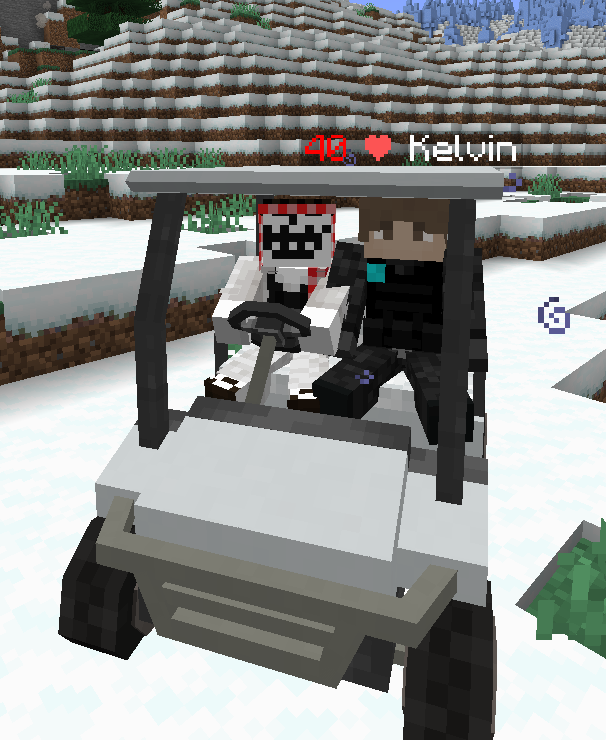
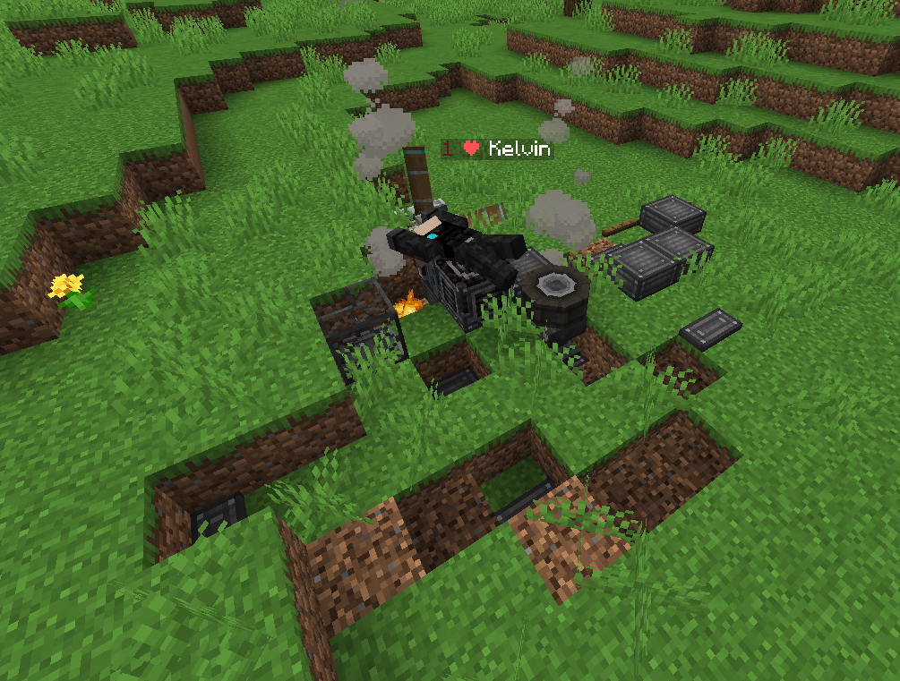
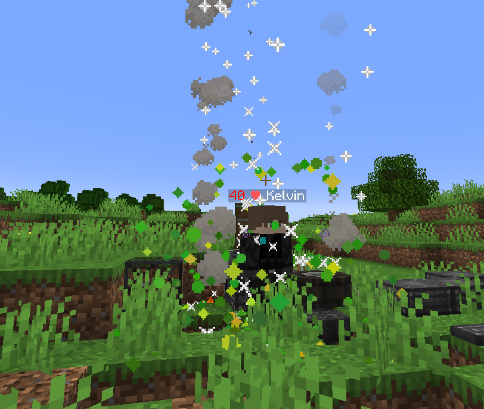
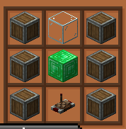

# CCC Kelvin (MC Kelvin)

**Minecraft 1.20.1 · Forge**

CCC Kelvin is a companion mod inspired by **Kelvin** from *Sons of the Forest*—the AI ally who follows you, helps gather resources, and watches your back. In this mod, Kelvin is your **basic assistant**: he trails you (or holds position), carries gear, mines on command, and can fight hostiles when you need protection.

The first time you join a world, a **helicopter crash intro** plays. Kelvin spawns **near the crash** with a **red glow** visible through blocks for about **30 seconds** so you can find him quickly.

When Kelvin is **downed**, he does not die permanently. **Right-click him with an enchanted golden apple** to bring him back (think of it like popping a totem—he gets back up ready to work). He may also **ask you for food** if he is hurt and has nothing to eat.

---

## Key features

- **Follow Me / Stay Here** — Toggle whether Kelvin sticks with you or holds his ground.
- **Crafting menu** — Full **inventory** support including **off-hand** and **armor** slots.
- **Health bar** — Clear feedback on his condition.
- **Auto-eating** — Around **50% HP** he eats if he has food; if his inventory has no food, he **asks you** so he can heal.
- **Cannot permanently die** — Only **downed**; revive with an **enchanted golden apple** via right-click.
- **Achievement: Homie for Life** — **First time** you revive Kelvin with a gapple: **firework display** and **three enchanted golden apples** (one-time reward).
- **Smart armor** — Give him better gear and he **auto-equips** the best armor he is holding.
- **Protect Me** — With protection on, nearby **hostiles** are chased and fought **bare-handed or with a sword**.
- **Pathfinding & stuck recovery** — Can **break blocks** to carve stairs or escape when stuck.
- **Auto miner — Go Mine** — Open **Go Mine**, **pick a block type**, then **left-click a chest with the Kelvin Summoner** to set the deposit chest. He mines and **deposits full stacks** into that chest. Includes **basic Nether** support (tunneling / strip-style mining).
- **Helicopter crash scene** on **first world join**, Kelvin nearby with temporary **red outline** through walls.
- **Kelvin Summoner** — Remote crafted with **Create** parts; **instantly recalls** Kelvin to you. See recipe below.

### Kelvin Summoner (Create)

The summoner is crafted from **Create** items (e.g. andesite casing, linked controller) so you can pull Kelvin to your side at any time.

---

## Required mods

These are required **alongside** CCC Kelvin for the mod to work as intended:

- **Create**
- **Clockwork**
- **Trackwork**
- **Copycats+**
- **Quark**

The **Kelvin Summoner** recipe uses **Create** items (e.g. andesite casing, linked controller). You also need **MCglTF** on the **client** (see `mods.toml`) for glTF rendering, plus **MrCrayfish Framework** and **Posture** for the embedded vehicle code path.

---

## Credits

- **[MCglTF](https://www.curseforge.com/minecraft/mc-mods/mcgltf)** — glTF model rendering on Forge; this mod depends on it for client-side glTF content.
- **MrCrayfish** — **[MrCrayfish’s Vehicle Mod](https://github.com/MrCrayfish/MrCrayfishVehicleMod)** ecosystem (**Framework**, vehicle code, **Posture**). Vehicle-related pieces used here remain **owned and credited to the original authors**; CCC Kelvin embeds that slice under the same spirit as community ports.

CCC Kelvin itself is by **Huzzyman** and **Sam** (see `gradle.properties`). *Sons of the Forest* and Kelvin are trademarks of their respective owners; this is an **unofficial fan-inspired** Minecraft mod, not affiliated with Endnight Games.

---

## Repository layout

- `docs/readme/` — Images used by this README (copied from the author’s machine for documentation).
